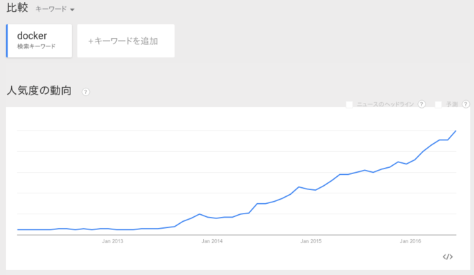

class: center, middle

.title[Dockerで作る<br/>機械学習研究開発環境]
<br/>
.subtitle[気軽に始めるTensorFlow]
<br/>
<br/>
<br/>
<br/>
.author[佐々木 勇人]
.institution[横浜国立大学 濱上研究室]


.date[2016年7月9日(土)]

---
class: center
# 自己紹介

---

# TensorFlowとは？

---

# Dockerとは？

- 名前は聞いたことがある &rarr; .red[最近勢い増]
- VirtualBoxとは何が違う？ &rarr; .red[**コンテナ**技術]
- 結局何ができる？ &rarr; .red[**移植性**の高い環境構築]


<br/>
<br/>

.left-column[

]
.right-column[

]

---

# Dockerの勢い

<br/>
.center[

]

---
# VirtualBoxとの違い
## 環境を論理的に区切るための手段が異なる

.left-column[

.center[
*コンテナ技術*
]

- 各コンテナがホストOSの<br/>カーネルを共有
- 名前空間で管理するため<br/>オーバーヘッドが.red[小さい]
]
.right-column[

.center[
*ホスト技術*
]
- 仮想環境毎にゲストOSを<br/>起動
- OS規模で管理するため<br/>オーバーヘッドが.blue[大きい]
]

???
仮想化技術は, ある環境の再現に使われる場合や，ホストマシンの環境を汚さないようにするために利用されることが多い

---
# VirtualBoxとの違い
## DockerはLinux専用

- WindowsやMacでは, **VirtualBox**上でDockerを使用する

.center[

<br/>
*Windows上でのDocker利用*
]
---
# 結局何ができる？
<br/>
## コンテナが軽量なため環境の移植が容易<br/>(高い**ポータビリティ**)

- 異なるマシンで利用可
- 環境の破棄・再構築が容易

.center.big[&darr;]

## Dockerを使うと...

- 実験の再現
- 研究の引き継ぎ

.large[を容易に実現可能]

---
# 具体例

## Dockerを使ってGitLabのサーバを立てる
- 設定変更・アップデートの場合には，コンテナを立て直す
<br/>

## 開発環境を共有する
- Pythonのライブラリなどをイメージ化して配布する
<br/>

## 他の人がすぐに再現実験を行うことができる
- 大抵の場合，実験用コードでは何かしらのライブラリを利用しているはず
- 再現実験のためにライブラリをいちいちインストールする必要がない
<br/>
<br/>
<br/>

.center[
.border[
.big[
コンテナのイメージ化技術
]
]
]

---
# Dockerイメージ

## イメージとは？
- コンテナのひな形
    - イメージからコンテナを生成する
- コンテナに必要なファイル群をまとめたもの
    - ライブラリやOS, 設定ファイルなど

## イメージの取得方法
2種類の方法が存在する
1. イメージをダウンロードしてくる
    - [Docker Hub](https://hub.docker.com/)というイメージ共有サイトを利用する
2. イメージを作成する
    - コンテナを直接編集する方法
    - Dockerfileを利用した方法

---
# Dockerイメージ
## イメージのダウンロード - pullコマンド -

[Docker Hub](https://hub.docker.com/)からダウンロードできる

```sh
# Docker Hubから'python numpy'というキーワードで検索
$ docker search 'numpy'
NAME                  DESCRIPTION                          STARS     OFFICIAL   AUTOMATED
ruimashita/numpy      ubuntu 14.04 python 2.7 numpy        0                    [OK]
patavee/numpy         Dockerfile for NumPy (Python 2.7).   0                    [OK]
halo9pan/cuda-numpy   Python numpy with CUDA support       0                    [OK]

# 上記のvimagick/pythonをダウンロード
$ docker pull halo9pan/cuda-numpy

# ダウンロードしたイメージの確認
$ docker images
```

- *search*コマンドで，イメージの検索
- *pull*コマンドで，イメージのダウンロード
- *images*コマンドで，ローカルにあるイメージを一覧表示

---

# Dockerイメージ
## イメージの作成方法 - commitコマンド - 

```sh
# コンテナの起動
$ docker run -itd --name ub ubuntu bash
$ docker exec -it ub bash
```
```sh
# コンテナ内で環境構築
$ sudo apt-get update
$ sudo apt-get install -y python2.7
$ exit
```
```sh
# ubコンテナからhytssk/python:2.7というイメージを作成
$ docker ps
CONTAINER ID   IMAGE    COMMAND   CREATED         STATUS         PORTS   NAMES
70ba387360bf   ubuntu   "bash"    7 seconds ago   Up 6 seconds           ub
*$ docker commit ub hytssk/python:2.7 
```

- *run*コマンドでコンテナを起動
- *exec*コマンドでコンテナのターミナルに接続
- *ps*コマンドで動作中のコンテナを一覧表示
- *commit*コマンドで，指定したコンテナをイメージ化

---
# Dockerイメージ
## イメージの作成方法 - Dockerfile -

```sh
# Dockerfileを編集
$ vi Dockerfile
```

```Dockerfile
# Dockerfile
FROM ubuntu
MAINTAINER Hayato Sasaki <abc@mail.com>
RUN apt-get update && apt-get install -y python2.7
```
```sh
# Dockerfileからイメージを作成
$ ls
Dockerfile
*$ docker build -t hytssk/python:2.7 .
```

- *build*コマンドで指定ディレクトリ内に存在するDockerfileからイメージを作成

.center[
.border[
.big[
環境の構成をコード化できる<br/>
Dockerfileを利用したイメージ生成のほうが一般的
]
]
]

---
# Dockerの運用フロー

.left-column.g8.center[
## 構築時
.mermaid[
graph TD
subgraph 
    B["<em>Dockerfileを記述</em>"]
    B-->C["<em>Dockerfileからイメージを作成</em>"]
    C-->D["<em>イメージをpush\(アップロード\)</em>"]
end
]
<br/>
]
.right-column.g8.center[
## 利用時
.mermaid[
graph TD
subgraph 
    A[<em>イメージをpull</em>]-->B[<em>イメージからコンテナを作成</em>]
    B-->C[<em>コンテナ内で開発</em>]
end
]
<br/>
<br/>
]


###イメージのpush

```sh
$ docker login
Login with your Docker ID to push and pull images from Docker Hub. If you don't have a Docker ID, head over to https://hub.docker.com to create one.
Username : 
Password :
Login Succeeded
*$ docker push hytssk/python:2.7
```

---

# ここまでのまとめ

## Dockerはコンテナを利用した仮想化技術

- Dockerイメージにより容易に**環境の配布・利用**が可能
- ホスト型と比べてオーバーヘッドが小さく**環境の構築・破棄**が容易

## DockerはLinux専用

- Windowsで利用するためには**VirtualBox**が必要

## 開発環境の構築に最適

- 開発環境のイメージ化により**再現性**を確保
- チーム内で**開発環境を共有**

---

# 今回の目標
## WindowsでTensorFlow実行環境を構築する

1. Dockerのインストール
2. TensorFlowコンテナの起動
3. TensorFlowを利用したプログラムを実行

<br/><br/>
## DockerでGUIを利用可能にする

1. MobaXtermをインストール
2. SSHサーバがインストールされたコンテナを準備
3. X11フォワーディングで, コンテナに接続
4. GUIアプリケーション(matplotlibなど)の実行を確認
---

# DockerでTensorFlowを<br/>利用する利点

- Windowsではインストール方法が提供されていない
    - 基本的には仮想環境でLinuxを動かす必要がある
- TensorFlowのバージョンアップに対応しやすい
    - TensorFlowはオープンソースで開発されている<br/>*&rarr;* 開発ペースが早い
    - 新旧両方のバージョンのコンテナを作成することで<br/>スムーズに移行ができる

.center[

]

---

class: center, middle

# WindowsでTensorFlow<br/>実行環境を構築する

---

# dockerのインストール
## dockerのインストール方法

### Linuxの場合

.big[&rarr; apt等のパッケージマネージャからインストール]

### Macの場合<br/>&emsp;&emsp;[OS X 10.10.3 以降のOS, Extended Page Tables搭載マシン]

.big[&rarr; Docker for Mac]

### Windowsの場合<br/>&emsp;&emsp;[Hyper-Vを利用<br/>&emsp;&emsp;(Windows 8以降, Pro/Education/Enterpriseエディション)]

.big[&rarr; Docker for Windows]

### 上記以外

.big[&rarr; **Docker ToolBox**]

.center[
.border[
.big[
今回はDocker ToolBoxをインストール
]
]
]

---

# dockerのインストール
## docker toolboxを利用したインストール

1. [公式サイト](http://docker)からDockerToolBoxのインストーラをダウンロード
2. インストーラを起動し，指示にしたがってインストール
3. Docker Quickstart Terminalを起動

---

# TensorFlowコンテナの起動

## TensorFlowイメージのpull(ダウンロード)
```sh
$ docker pull tensorflow/tensorflow
```

## ダウンロードしたイメージをコンテナ化

```sh
# コンテナと共有したいディレクトリを作成
$ mkdir -p /c/Users/hytssk/docker/workspace
$ cd /c/Users/hytssk/docker/workspace
# コンテナの起動
$ docker run -d --name tensorflow -p 8888:8888 -p 6006:6006 -v "${PWD}":/notebooks/host tensorflow/tensorflow
```

- *-d*オプション: コンテナで実行されるコマンドをデーモン化
- *--name*オプション: コンテナに名前を付加
- *-p*オプション: ポートフォワーディング<br/>&emsp;&emsp;&emsp;(<ホスト側ポート>:<コンテナ側ポート>)
- *-v*オプション: ボリュームの共有
<br/>&emsp;&emsp;&emsp;(<ホスト側のディレクトリ>:<コンテナ側ディレクトリ>)

---

# TensorFlowを利用した<br/>プログラム実行
## ターミナルを利用する方法
```bash
# コンテナのターミナルに接続
$ docker exec -it tensorflow bash
# ホストとの共有ディレクトリに移動
$ cd /notebooks/host
# コード作成
$ vi test.py
# プログラムの実行
$ python test.py
```

- execコマンドによりtensorflowコンテナのターミナルに接続
- コンテナ内でpythonプログラムを実行
- コードはWindows側のC:\\\\Users\hytssk\docker\workspace\test.pyを<br/>好みのエディタで編集

---

# TensorFlowを利用した<br/>プログラム実行
## ターミナルを利用する方法
.left-column.g9[
``` python
# test.py
import tensorflow as tf
# グラフの定義
a = tf.constant(
    [[1, 2], [3, 4]],
    name='a')
b = tf.constant(
    [[5, 6], [7, 8]], 
    name='b')
c = a + b
# グラフの計算
with tf.Session() as sess:
    init = \
        tf.initialize_alll_variables()
    sess.run(init)
    print 'a = \n%s\n' % sess.run(a)
    print 'b = \n%s\n' % sess.run(b)
    print 'c = a + b = \n%s\n' % \
        sess.run(c)

```
]

.right-column.g7[
``` sh
# 実行結果
$ python test.py
a = 
[[1 2]
 [3 4]]

b = 
[[5 6]
 [7 8]]

c = a + b = 
[[ 6  8]
 [10 12]]
```
]

---

# TensorFlowを利用した<br/>プログラム実行
## jupyterを利用する方法
### jupyterとは？
> The Jupyter Notebook is a web application that allows you to create and share documents that contain live code, equations, visualizations and explanatory text. Uses include: data cleaning and transformation, numerical simulation, statistical modeling, machine learning and much more.

[jupyter公式サイト](http://jupyter.org/)より引用

- Pythonを始めとするプログラミング言語をインタラクティブに実行
- コード， 画像，説明文，数式をノートのように記述可能
- TensorFlowのコンテナには最初からインストール済み
- Webブラウザから利用

---

# TensorFlowを利用した<br/>プログラム実行
## jupyterを利用する方法
### jupyterとは？
.center[

]

---

# TensorFlowを利用した<br/>プログラム実行
## jupyterを利用する方法

### ブラウザで次のURLを入力

http://192.168.99.100:8888

.center[

]

---

# TensorFlowを利用した<br/>プログラム実行
## jupyterを利用する方法

- hostディレクトリに移動後, 画面右上のNew->Python 2を選択
- cellにコードを記述
- Shift + EnterでCell内のコードを実行

.center[

]

さらに詳しくは
[jupyter documentation](http://jupyter.readthedocs.io/en/latest/index.html)
---

class: center, middle
# DockerでGUIを<br/>利用可能にする

---

# MobaXtermの<br/>インストール
## MobaXtermとは

## MobaXtermのダウンロード/インストール

---

# SSH接続可能な<br/>コンテナ作成
## コンテナでopenssh-serverをインストール

---

# X11フォワーディング

---

# GUIアプリケーションの<br/>実行確認

---

# TensorBoardを利用した<br/>プログラムの可視化

---

# まとめ

---

# 参考文献/参考サイト

---

# 各種データ

---
