class: center, middle

.title[Dockerで作る<br/>機械学習研究開発環境]
<br/>
.subtitle[気軽に始めるTensorFlow]
<br/>
<br/>
<br/>
<br/>
.author[佐々木 勇人]
.institution[横浜国立大学 濱上研究室]


.date[2016年7月9日(土)]


---
class: center


.huge[https://hyt-sasaki.github.io/docker_slides/]

---

# 自己紹介
- 濱上研究室M2 佐々木勇人
- GitHubアカウント [@hyt-sasaki](https://github.com/hyt-sasaki)
- 最近Qiita始めました [@hyt-sasaki](http://qiita.com/hyt-sasaki)
- 研究内容
    - 全方位動画像を用いた自己位置推定
    - マルチモーダル深層学習

.left-column[
<br/>
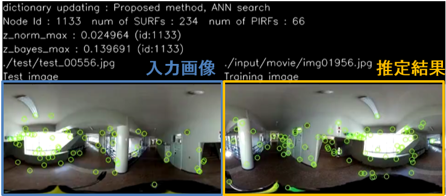
.center[
*自己位置推定*
]
]
.right-column[
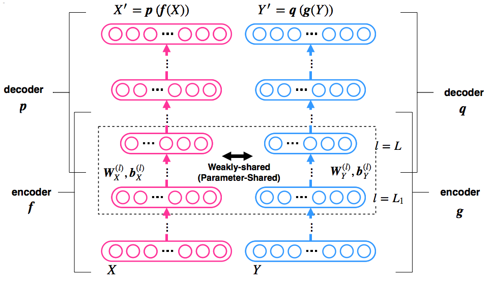
.center[
*マルチモーダル深層学習*
]
]


---
# 発表の流れ
## 前半
.big[TensorFlow/Dockerについて]
.large[
- Dockerについての説明がメイン
    - 仮想化技術について
    - Dockerイメージについて
]

## 後半
.big[Dockerを利用した研究開発環境の構築]
.large[
- WindowsでTensorFlow実行環境を構築
- DockerでGUIを利用可能なターミナル環境を構築
- TensorBoardによるプログラムの可視化
]

---

# [TensorFlow](https://www.tensorflow.org/)とは？

- Googleが開発したオープンソースライブラリ
- *深層学習*を行うライブラリとして有名
- *データフローグラフ*により, 数学的な処理を記述
    - ノードが数学的な処理(内積など)を表す
    - エッジがデータ(テンソル)を表す
    - **TensorBoard**により，グラフを可視化できる
- pythonやc++のAPIが利用可能
- **基本的にLinuxもしくはMacで動作**

.center[
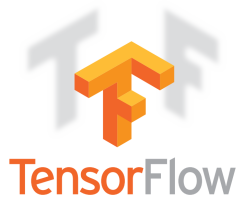  
.small[TensorFlow, the TensorFlow logo and any related marks are trademarks of Google Inc.]
]

---

# [Docker](https://www.docker.com/)とは？

### **コンテナ型**の仮想化を行うオープンソースソフトウェア

## VirtualBoxとは何が違う？
.red[VirtualBoxはホスト型の仮想化]
## 結局何ができる？
.red[**移植性**の高い環境構築]


.left-column[

]
.right-column[

]

---
# VirtualBoxとの違い

.left-column[
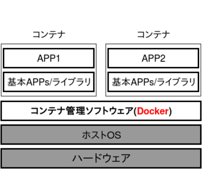
.center[
*コンテナ技術*
]

- 各コンテナがホストOSの<br/>カーネルを共有
- 名前空間で管理するため<br/>オーバーヘッドが.red[小さい]
]
.right-column[
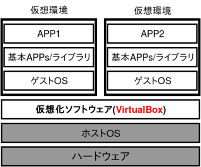
.center[
*ホスト技術*
]
- 仮想環境毎にゲストOSを<br/>起動
- OS規模で管理するため<br/>オーバーヘッドが.blue[大きい]
]

???
仮想化技術は, ある環境の再現に使われる場合や，ホストマシンの環境を汚さないようにするために利用されることが多い

---
# VirtualBoxとの違い
## DockerはLinux専用

- WindowsやMacでは, **VirtualBox**上でDockerを使用する

.center[

<br/>
*Windows上でのDocker利用*
]
---
# 結局何ができる？
<br/>
## コンテナが軽量なため環境の移植が容易<br/>(高い**ポータビリティ**)

- 異なるマシンで利用可
- 環境の破棄・再構築が容易

.center.big[&darr;]

## Dockerを使うと...

- 実験の再現
- 研究の引き継ぎ

.large[を容易に実現可能]

---
# 具体例

## Dockerを使ってGitLabのサーバを立てる
- 設定変更・アップデートの場合には，コンテナを立て直す
<br/>

## 開発環境を共有する
- Pythonのライブラリなどをイメージ化して配布する
<br/>

## 他の人がすぐに再現実験を行うことができる
- 大抵の場合，実験用コードでは何かしらのライブラリを利用しているはず
- 再現実験のためにライブラリをいちいちインストールする必要がない
<br/>

.center[
.border[
.big[
コンテナのイメージ化技術
]
]
]

---
# Dockerイメージ

## イメージとは？
- コンテナのひな形
    - イメージからコンテナを生成する
- コンテナに必要なファイル群をまとめたもの
    - ライブラリやOS, 設定ファイルなど

## イメージの取得方法
- イメージをダウンロードしてくる
    - [Docker Hub](https://hub.docker.com/)というイメージ共有サイトを利用する
- イメージを作成する
    - コンテナを直接編集する方法
    - Dockerfileを利用した方法

---
# Dockerイメージ
## イメージのダウンロード - pullコマンド -
[Docker Hub](https://hub.docker.com/)からダウンロードできる
```sh
# Docker Hubから'python numpy'というキーワードで検索
$ docker search 'numpy'
NAME                  DESCRIPTION                          STARS     OFFICIAL   AUTOMATED
ruimashita/numpy      ubuntu 14.04 python 2.7 numpy        0                    [OK]
halo9pan/cuda-numpy   Python numpy with CUDA support       0                    [OK]
# 上記のvimagick/pythonをダウンロード
$ docker pull halo9pan/cuda-numpy
# ダウンロードしたイメージの確認
$ docker images
```
- *search*コマンドで，イメージの検索
- *pull*コマンドで，イメージのダウンロード
- *images*コマンドで，ローカルにあるイメージを一覧表示

---

# Dockerイメージ
## イメージの作成方法 - commitコマンド - 

```sh
# コンテナの起動
$ docker run -itd --name ub ubuntu bash
$ docker exec -it ub bash

# コンテナ内で環境構築
$ sudo apt-get update && sudo apt-get install -y python2.7
$ exit

# ubコンテナからhytssk/python:2.7というイメージを作成
$ docker ps
CONTAINER ID   IMAGE    COMMAND   CREATED         STATUS         PORTS   NAMES
70ba387360bf   ubuntu   "bash"    7 seconds ago   Up 6 seconds           ub
*$ docker commit ub hytssk/python:2.7 
```

- *run*コマンドでコンテナを起動
- *exec*コマンドでコンテナのターミナルに接続
- *ps*コマンドで動作中のコンテナを一覧表示
- *commit*コマンドで，指定したコンテナをイメージ化

---
# Dockerイメージ
## イメージの作成方法 - Dockerfile -

```sh
# Dockerfileを編集
$ vi Dockerfile
# Dockerfile
FROM ubuntu
MAINTAINER Hayato Sasaki <abc@mail.com>
RUN apt-get update && apt-get install -y python2.7
```
```sh
# Dockerfileからイメージを作成
$ ls
Dockerfile
*$ docker build -t hytssk/python:2.7 .
```

- *build*コマンドでDockerfileからイメージを作成

.center[
.border[
環境の構成をコード化できる<br/>
Dockerfileを利用したイメージ生成のほうが一般的
]
]

---
# Dockerの運用フロー

.left-column.g8.center[
## 構築時
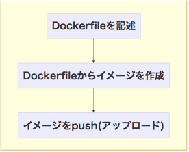
<br/>
]
.right-column.g8.center[
## 利用時
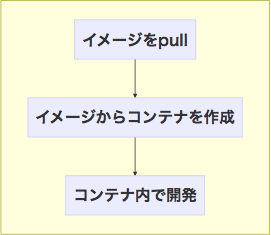
<br/>
<br/>
]


###イメージのpush

```sh
$ docker login
Login with your Docker ID to push and pull images from Docker Hub. If you don't have a Docker ID, head over to https://hub.docker.com to create one.
Username : 
Password :
Login Succeeded
*$ docker push hytssk/python:2.7
```

---

# ここまでのまとめ

## Dockerはコンテナを利用した仮想化技術

- Dockerイメージにより容易に**環境の配布・利用**が可能
- ホスト型と比べてオーバーヘッドが小さく**環境の構築・破棄**が容易

## DockerはLinux専用

- Windowsで利用するためには**VirtualBox**が必要

## 開発環境の構築に最適

- 開発環境のイメージ化により**再現性**を確保
- チーム内で**開発環境を共有**

---

# 今回の目標
## WindowsでTensorFlow実行環境を構築する

1. Dockerのインストール
2. TensorFlowコンテナの起動
3. TensorFlowを利用したプログラムを実行

<br/><br/>
## DockerでGUIを利用可能にする

1. MobaXtermをインストール
2. SSHサーバがインストールされたコンテナを準備
3. X11フォワーディングで, コンテナに接続
4. GUIアプリケーション(matplotlibなど)の実行を確認
---

# Docker+TensorFlowの利点
- Windowsではインストール方法が提供されていない
    - 基本的には*仮想環境*でLinuxを動かす必要がある
- TensorFlowのバージョンアップに対応しやすい
    - TensorFlowはオープンソースで開発されている<br/>*&rarr;* **開発ペースが早い**
    - 新旧両方のバージョンのコンテナを作成することで<br/>**スムーズに移行ができる**

.center[

]

---

class: center, middle

# WindowsでTensorFlow<br/>実行環境を構築する

---

# dockerのインストール
## dockerのインストール方法

### Linuxの場合

.big[&rarr; apt等のパッケージマネージャからインストール]

### Macの場合[Extended Page Tables搭載マシン]<br/>&emsp;&emsp;[OS X 10.10.3 以降のOS]

.large[&rarr; Docker for Mac]

### Windowsの場合[Hyper-V]<br/>&emsp;&emsp;[Windows 8以降, Pro/Education/Enterpriseエディション]

.large[&rarr; Docker for Windows]

### 上記以外

.large[&rarr; **Docker ToolBox**]

.center[
.border[
今回はDocker ToolBoxをインストール
]
]

---

# dockerのインストール
## docker toolboxを利用したインストール

1. [公式サイト](http://docker)からDockerToolBoxのインストーラをダウンロード
2. インストーラを起動し，指示にしたがってインストール
3. Docker Quickstart Terminalを起動

.center[
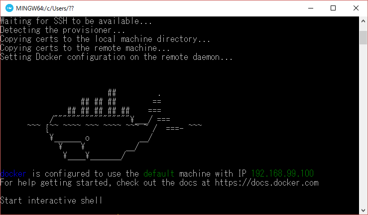
]

詳しくは[Qiitaの記事](http://qiita.com/hyt-sasaki/items/8f8312e277d1a4815ab6)参照

---

# TensorFlowコンテナの起動

## TensorFlowイメージのpull(ダウンロード)
```sh
$ docker pull tensorflow/tensorflow
```

## ダウンロードしたイメージをコンテナ化

```sh
# コンテナと共有したいディレクトリを作成
$ mkdir -p /c/Users/hytssk/docker/workspace
$ cd /c/Users/hytssk/docker/workspace
# コンテナの起動
$ docker run -d --name tensorflow -p 8888:8888 -p 6006:6006 -v "${PWD}":/notebooks/host tensorflow/tensorflow
```

- *-d*オプション: コンテナで実行されるコマンドをデーモン化
- *--name*オプション: コンテナに名前を付加
- *-p*オプション: ポートフォワーディング<br/>&emsp;&emsp;&emsp;(<ホスト側ポート>:<コンテナ側ポート>)
- *-v*オプション: ボリュームの共有
<br/>&emsp;&emsp;&emsp;(<ホスト側のディレクトリ>:<コンテナ側ディレクトリ>)

---

# TensorFlowコンテナの起動

## TensorFlowイメージのpull(ダウンロード)
```sh
$ docker pull tensorflow/tensorflow
```

## ダウンロードしたイメージをコンテナ化

```sh
# コンテナと共有したいディレクトリを作成
$ mkdir -p /c/Users/hytssk/docker/workspace
$ cd /c/Users/hytssk/docker/workspace
# コンテナの起動
$ docker run -d --name tensorflow -p 8888:8888 -p 6006:6006 -v "${PWD}":/notebooks/host tensorflow/tensorflow
```

- 8888番ポートは[jupyter]用のポート番号
- 6006番ポートはTensorBoard用のポート番号
    - TensorBoardはコンテナ内で手動で起動する必要がある
- 上記ポート番号を使ってWebアプリケーションを利用することが可能になる


---

# TensorFlowを利用した<br/>プログラム実行
## ターミナルを利用する方法
```bash
# コンテナのターミナルに接続
$ docker exec -it tensorflow bash
# ホストとの共有ディレクトリに移動
$ cd /notebooks/host
# コード作成
$ vi test.py
# プログラムの実行
$ python test.py
```

- execコマンドによりtensorflowコンテナのターミナルに接続
- コンテナ内でpythonプログラムを実行
- コードはWindows側の`C:¥¥Users¥hytssk¥docker¥workspace¥test.py`を好みのエディタで編集

---

# TensorFlowを利用した<br/>プログラム実行
## ターミナルを利用する方法
.left-column.g9[
``` python
# test.py
import tensorflow as tf
# グラフの定義
a = tf.constant(
    [[1, 2], [3, 4]], name='a')
b = tf.constant(
    [[5, 6], [7, 8]], name='b')
c = a + b
# グラフの計算
with tf.Session() as sess:
    init = \
        tf.initialize_alll_variables()
    sess.run(init)
    print 'a = \n%s\n' % sess.run(a)
    print 'b = \n%s\n' % sess.run(b)
    print 'c = a + b = \n%s\n' % \
        sess.run(c)

```
]

.right-column.g7[
``` sh
# 実行結果
$ python test.py
a = 
[[1 2]
 [3 4]]

b = 
[[5 6]
 [7 8]]

c = a + b = 
[[ 6  8]
 [10 12]]
```
]

---

# TensorFlowを利用した<br/>プログラム実行
## jupyterを利用する方法
### jupyterとは？
> The Jupyter Notebook is a web application that allows you to create and share documents that contain live code, equations, visualizations and explanatory text. Uses include: data cleaning and transformation, numerical simulation, statistical modeling, machine learning and much more.

[jupyter公式サイト](http://jupyter.org/)より引用

- Pythonを始めとするプログラミング言語をインタラクティブに実行
- コード， 画像，説明文，数式をノートのように記述可能
- TensorFlowのコンテナには最初からインストール済み
- Webブラウザから利用

---

# TensorFlowを利用した<br/>プログラム実行
## jupyterを利用する方法
### jupyterとは？
.center[
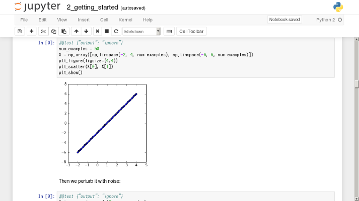
]

---

# TensorFlowを利用した<br/>プログラム実行
## jupyterを利用する方法

### ブラウザで次のURLを入力

http://192.168.99.100:8888

.center[
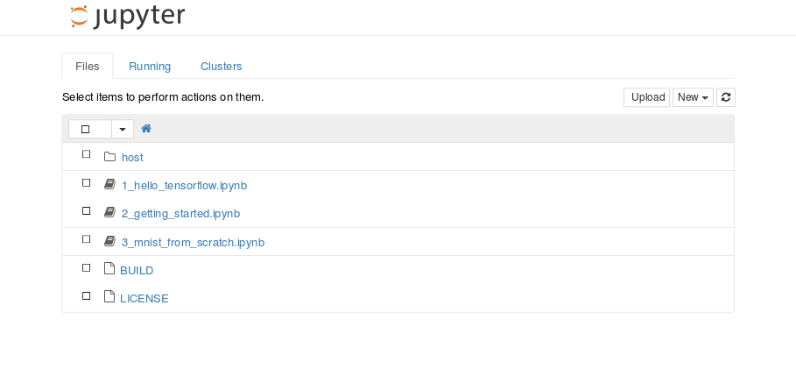
]

---

# TensorFlowを利用した<br/>プログラム実行
## jupyterを利用する方法

- hostディレクトリに移動後, 画面右上のNew->Python 2を選択
- cellにコードを記述
- Shift + EnterでCell内のコードを実行

.center[
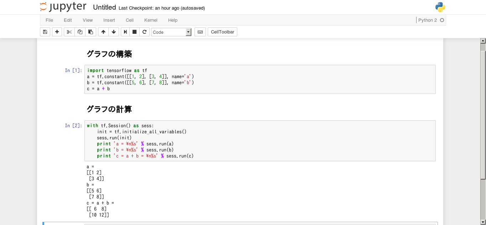
]

さらに詳しくは
[jupyter documentation](http://jupyter.readthedocs.io/en/latest/index.html)
---

class: center, middle
# DockerでGUIを<br/>利用可能にする

---

# MobaXtermの<br/>インストール
## [MobaXterm](http://mobaxterm.mobatek.net/)とは

> Enhanced terminal for Windows with X11 server, tabbed SSH client, network tools and much more

- SSH接続が可能なターミナル
- **X11フォワーディング**によりサーバ側の**GUIアプリ**を起動可能

## MobaXtermのダウンロード/インストール
- [公式サイト](http://mobaxterm.mobatek.net/MobaXterm_Setup_9.1.msi)からインストーラをダウンロード
- 基本的に, インストーラの指示に従えばよい

---

# MobaXtermで<br/>boot2dockerに接続
## Docker Quickstart Terminalを起動

.center[
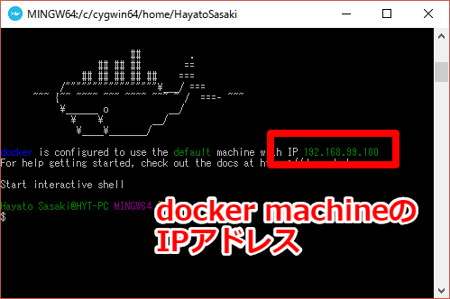
]

---

# MobaXtermで<br/>boot2dockerに接続
## MobaXtermを起動

.center[
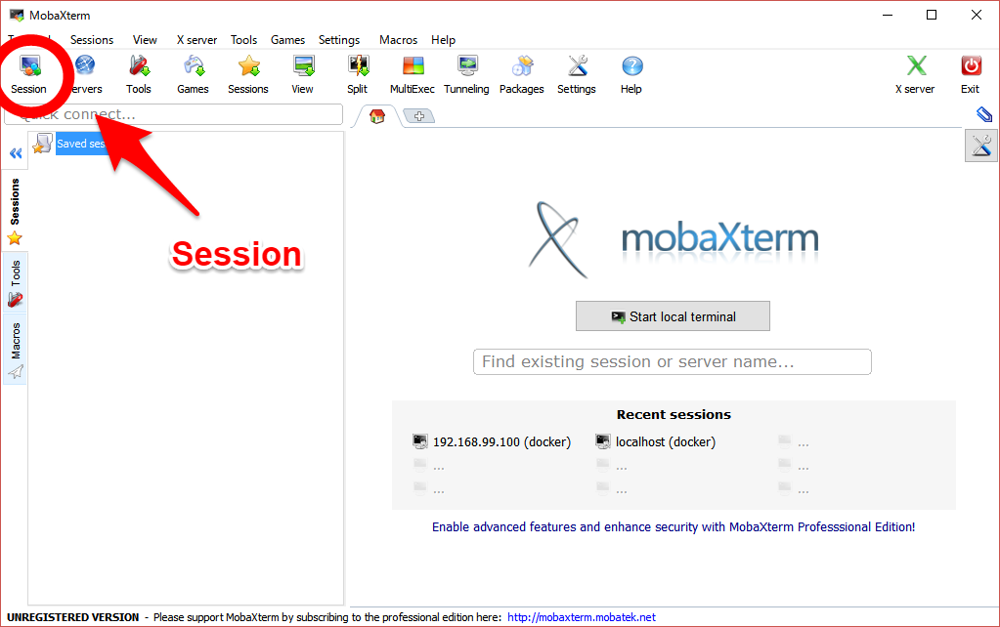
]

---

# MobaXtermで<br/>boot2dockerに接続
## SSH接続の設定

.center[
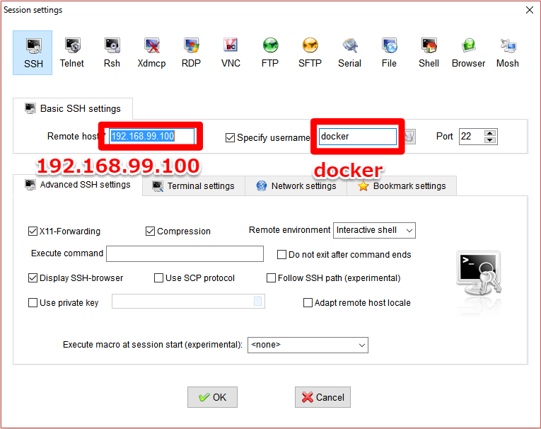
]

初回ログイン時はパスワードの入力が必要となる  
Password: tcuser

---

# MobaXtermで<br/>boot2dockerに接続
## boot2dockerに接続完了

.center[
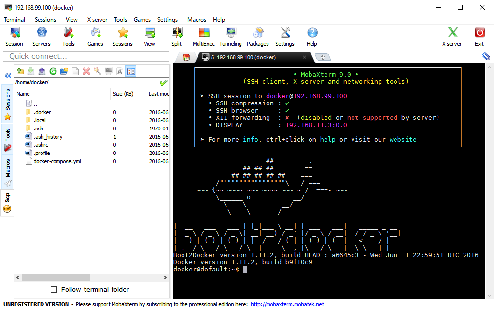
]

---

# SSH接続可能な<br/>コンテナ作成
## コンテナでopenssh-serverをインストール
``` sh
$ mkdir -p /c/Users/hytssk/docker/dockerfiles/mytensorflow
$ cd /c/Users/hytssk/docker/dockerfiles/mytensorflow
```
``` Dockerfile
# Dockerfile
# C:\\Users\hytssk\docker\dockerfiles\mytensorflow\Dockerfilesを
# 好みのエディタで作成
From tensorflow/tensorflow
MAINTAINER Hayato Sasaki <abc@mail.com>
RUN apt-get update && \
    apt-get install -y openssh-server python-qt4
# 以下略(次ページ)
```

```sh
$ ls
Dockerfile
$ docker build -t hytssk/tensorflow:ssh .
```

---

# SSH接続可能な<br/>コンテナ作成
## コンテナでopenssh-serverをインストール
``` Dockerfile
# Dockerfile
From tensorflow/tensorflow
MAINTAINER Hayato Sasaki <abc@mail.com>
RUN apt-get update && \
    apt-get install -y openssh-server python-qt4
RUN adduser --disabled-password --gecos "" developer && \
    echo "developer ALL=(ALL) NOPASSWD:ALL" >> /etc/sudoers && \
    echo "developer:developer" | chpasswd && \
    cp -r /notebooks /home/developer && chown -R developer:developer /home/developer/
RUN sed -ri 's/^UsePAM yes/UsePAM no/' /etc/ssh/sshd_config && \
    sed -ri 's/: agg/: Qt4Agg/g' /usr/local/lib/python2.7/dist-packages/matplotlib/mpl-data/matplotlibrc && \
    mkdir -p /var/run/sshd && \
    chmod 755 /var/run/sshd
ENV QT_X11_NO_MITSHM 1
USER developer
WORKDIR /home/developer
CMD ["sudo", "/usr/sbin/sshd", "-D"]
```

---

# X11フォワーディング
```sh
# コンテナを起動
$ docker run -d --name mytensorflow -p 10022:22 -p 8889:8888 -p 6007:6006 -v /c/Users/hytssk/docker/workspace:/notebooks/host hytssk/tensorflow:ssh
```
.center[
作成したコンテナへのSSH接続設定  
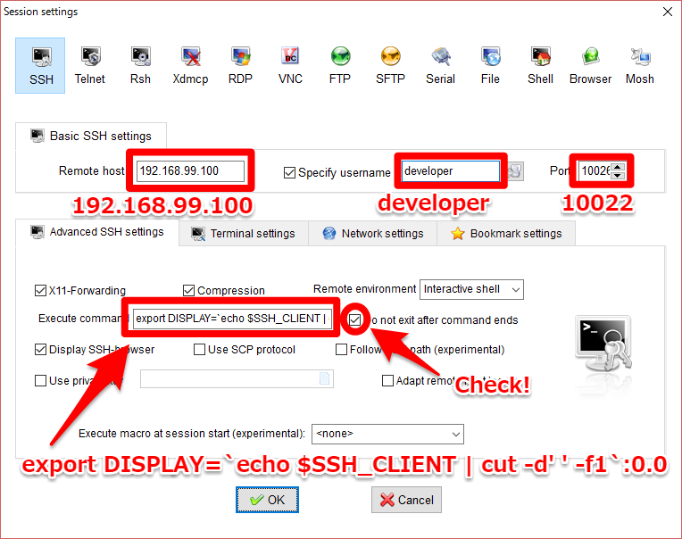  
]

```sh
# 環境変数DISPLAYを設定(上記画像のExecute command欄に入力)
export DISPLAY=`echo $SSH_CLIENT | cut -d' ' -f1`:0.0
```

---

# GUIアプリケーションの<br/>実行確認
コンテナへのSSH接続確認後, 次のプログラムを実行
``` python
# plot_test.py
import numpy as np
import matplotlib.pyplot as plt

x = np.arange(-3, 3, 0.1)
y = np.sin(x)
plt.plot(x, y)
plt.show()
```
.left-column[
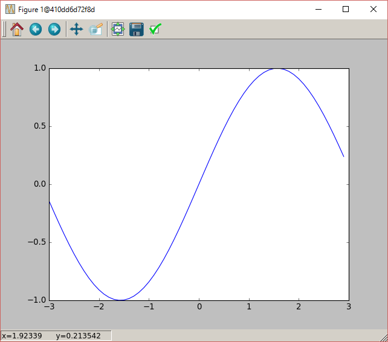  
]
.right-column.g10[
matplotlibを使った<br/>GUIアプリケーションの実行を確認
]

---

# TensorBoardを利用した<br/>プログラムの可視化

```sh
# boot2docker上で操作
$ git clone https://github.com/hyt-sasaki/docker-slides.git
$ cd docker-slides
$ git checkout master
# TensorFlowのイメージ生成
$ docker build -t mytensorflow dockerfiles/TensorFlow
$ docker run -d --name tensorflow -p 8888:8888 -p 6006:6006 -p 10022:22 -v "${PWD}"/testcodes:/home/developer/notebooks/host mytensorflow
$ docker exec -it mytensorflow bash
```
```sh
# TensorBoard用ログファイルを生成プログラムを実行
$ cd notebooks/host
$ python tensorboard_test.py
$ tensorboard --logdir=/tmp/mnist_logs
```

tensorboard起動後, http://192.168.99.100:6006 に接続

---

# TensorBoardを利用した<br/>プログラムの可視化
.left-column[
<br/>
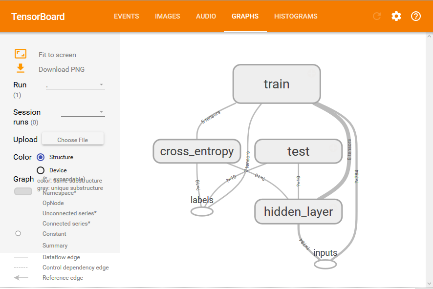  
.center[
*グラフ表示*
]
]
.right-column[
<br/>
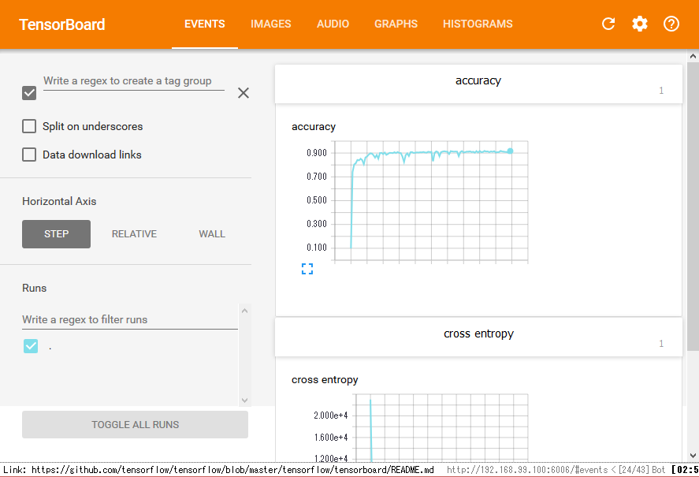  
.center[
*スカラー値の記録*
]
]


---

# TensorBoardを利用した<br/>プログラムの可視化
[tensorboard_test.py](https://github.com/hyt-sasaki/docker_slides/blob/master/testcodes/TensorFlow/tensorboard_test.py)

```python
# tensorboard_test.py L9 ~ L13
            y = tf.nn.softmax(tf.matmul(input_placeholder, W) + b)
            # Variableのヒストグラムを作成
*           tf.histogram_summary('Weights', W)
*           tf.histogram_summary('bias', b)
*           tf.histogram_summary('outputs', y)
```
```python
# tensorboard_test.py L18 ~ L23
def loss(output, labels_placeholder):
    with tf.name_scope('cross_entropy'):
        cross_entropy =\
            -tf.reduce_sum(labels_placeholder * tf.log(output))
        # ノード(cross_entropy)の出力値を記録
*       tf.scalar_summary('cross entropy', cross_entropy)
return cross_entropy
```

---

# TensorBoardを利用した<br/>プログラムの可視化
[tensorboard_test.py](https://github.com/hyt-sasaki/docker_slides/blob/master/testcodes/TensorFlow/tensorboard_test.py)

```python
# tensorboard_test.py L57 ~ L66
 with tf.Session() as sess:
        output = inference(inputs_ph)
        loss = loss(output, labels_ph)
        acc = accuracy(labels_ph, output)
        training_op = training(loss, FLAGS.learning_rate)
        # 全サマリーノードを一つのノードに統合
*       merged = tf.merge_all_summaries()
        # サマリーデータをファイルに書き込むためのライタを作成
*       writer = tf.train.SummaryWriter('/tmp/mnist_logs', sess.graph)
        init = tf.initialize_all_variables()
 sess.run(init)
```

詳しくは[公式ドキュメント](https://www.tensorflow.org/versions/r0.7/how_tos/summaries_and_tensorboard/index.html)を参照

---

# まとめ

.big[

- TensorFlowとDockerの概要を説明した

- Dockerを用いたTensorFlowの環境構築について説明した

- 説明に出てきたプログラムやDockerfileは<br/>[ここ](https://github.com/hyt-sasaki/docker_slides)からダウンロードできる

- 詳しくは後ろのページ(_各種データ_のページ)を参照

]

---

# 参考文献/参考サイト
- WINGSプロジェクト阿佐志保 (2015) 『プログラマのためのDocker教科書： インフラの基礎知識&コードによる環境構築の自動化』 株式会社翔泳社
- [Docker公式サイト](https://www.docker.com/)
- [TensorFlow公式サイト](https://www.tensorflow.org/)
- [jupyter公式サイト](http://jupyter.org/)
- [DockerコンテナのLinux GUIアプリをWindowsで起動する](http://qiita.com/fireowl11/items/7a22510bc8951342d031)

---

# 各種データ
[GitHubページ](https://github.com/hyt-sasaki/docker_slides)
からDockerfile等をダウンロードできる
- TensorFlow + matplotlibのDockerfile
- Python + OpenCVのDockerfile

```sh
# boot2docker上で操作
$ git clone https://github.com/hyt-sasaki/docker-slides.git
$ cd docker-slides
$ git checkout master
```
```sh
# TensorFlowのイメージ生成
$ docker build -t mytensorflow dockerfiles/TensorFlow
$ docker run -d --name tensorflow -p 8888:8888 -p 6006:6006 -p 10022:22 -v "${PWD}"/testcodes:/home/developer/notebooks/host mytensorflow
```
```sh
# Python+OpenCVのイメージ生成
$ docker build -t myopencv dockerfiles/OpenCV
$ docker run -d --name opencv -p 10023:22 -v "${PWD}"/testcodes:/home/developer/host myopencv
```

詳しくは[README.md](https://github.com/hyt-sasaki/docker_slides/blob/88df76e8546a3c2552e05bff5d3a7a01f88bb7d1/README.md)を参照
